# Bricks-Heist

## Room Info

This room drops you into a compromised server tied to a WordPress site and asks you to work backward: regain access, identify the malware/miner activity, and answer several forensic-style questions about processes, services, and crypto wallet activity.

## Writeup

I started the machine, connected to the VPN, and verified connectivity with `ping MACHINE_IP`.

I added the host entry for the target:
`sudo nano /etc/hosts`

Screenshot:  
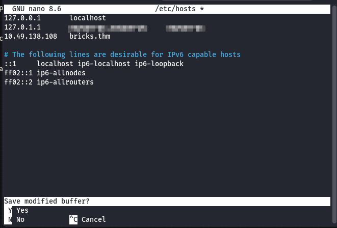

Then I ran a port scan:
`nmap -sV MACHINE_IP`

Screenshot:  
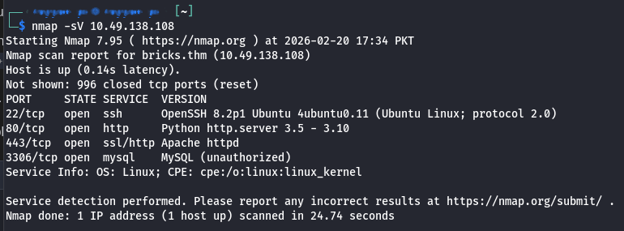

I also ran a more detailed scan to get scripts and detection:
`nmap -A MACHINE_IP`

Screenshot:  
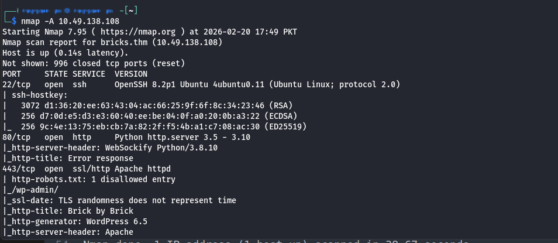

The site did not respond over HTTP, but it loaded over HTTPS. So I opened:
`https://bricks.thm/`

Screenshot:  

From the page and scan results, it looked like WordPress, so I ran WPScan. I created a free token at `https://wpscan.com/register/` and used:
`wpscan --url https://bricks.thm/ --api-token YOUR_API --disable-tls-checks`

Screenshot:  
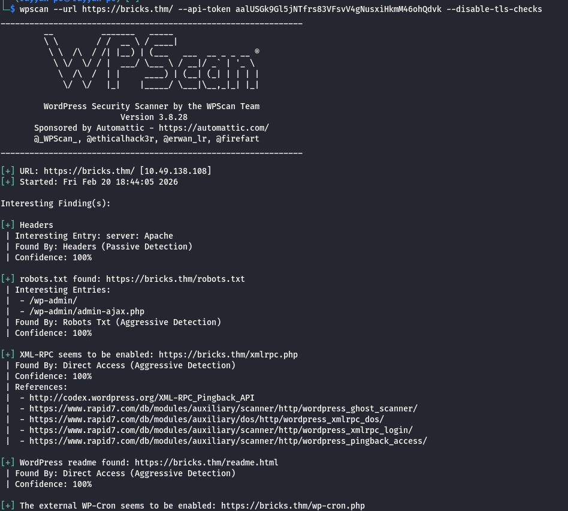

The scan results were large, so I pasted them into a text editor to review. The key finding was a vulnerable Bricks theme:
`Bricks < 1.9.6.1 - Unauthenticated Remote Code Execution (CVE-2024-25600)`

I searched the CVE and found a public PoC:
`https://github.com/Chocapikk/CVE-2024-25600`

I cloned and ran it:
- `git clone https://github.com/Chocapikk/CVE-2024-25600.git`
- `pip install -r requirements.txt`
- `python exploit.py -u https://bricks.thm`

After running the exploit, I got code execution and the first flag dropped in the same working directory.

Screenshot:  
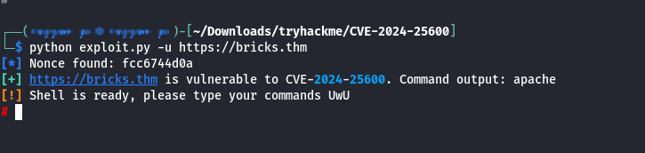  
Screenshot:  
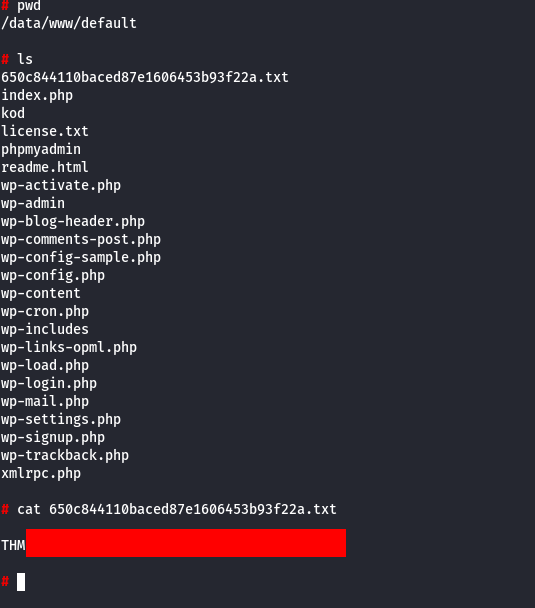

Next question: suspicious process name. I listed running services and immediately noticed something out of place:
`systemctl | grep "running"`

Screenshot:  
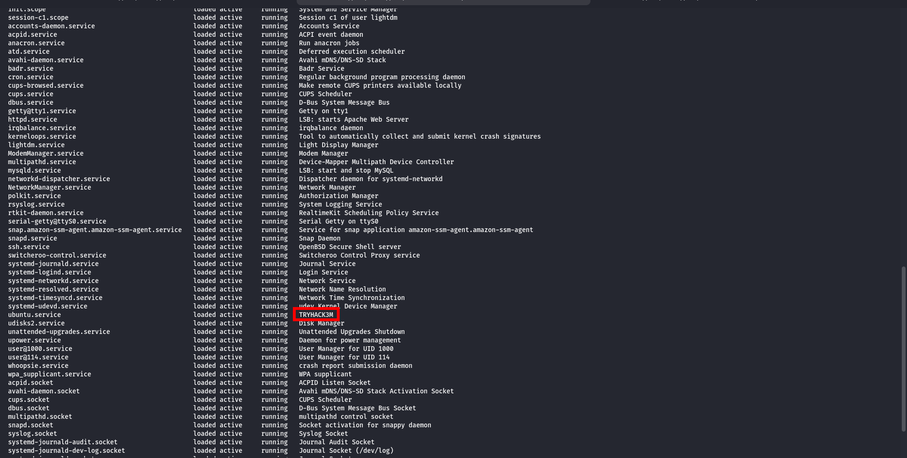

The suspicious service was `ubuntu.service`. To get the process name tied to it, I checked:
`systemctl status ubuntu.service`

That gave the actual process name required by the question.

Screenshot:  
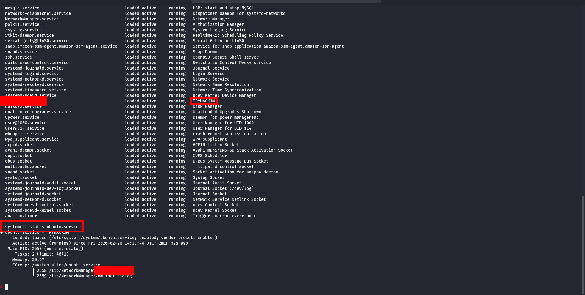

For the miner’s log file, I followed the breadcrumbs. The service referenced `nm-inet-dialog` under `/lib/NetworkManager`, so I explored that directory:
`ls /lib/NetworkManager`

Screenshot:  
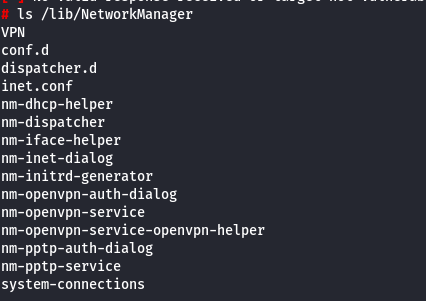

One of the config files contained the miner settings and the log file name.

Screenshot:  
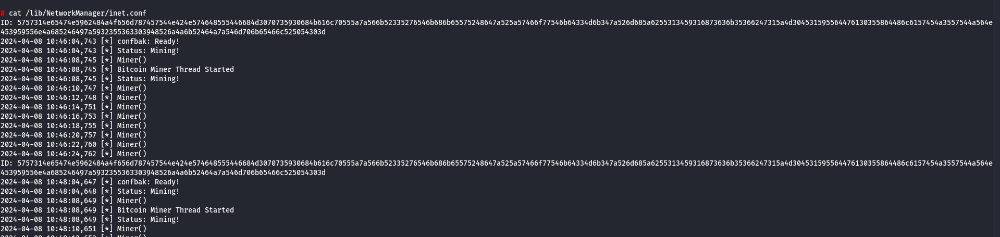

The config also included an encoded wallet address. I decoded it with CyberChef and found two BTC addresses (both begin with `bc`).

Screenshot:  
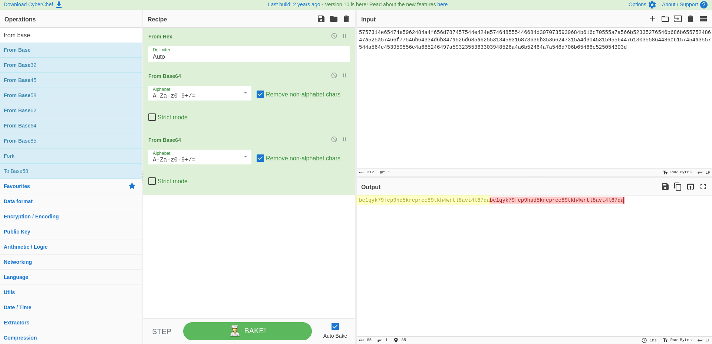

I looked up the wallet on a blockchain explorer (e.g., `blockchain.com`). One of the addresses linked to activity tied to a known threat group. The group name starts with `LOCK` and is part of the final question.  
Find it on your own.

Screenshot:  
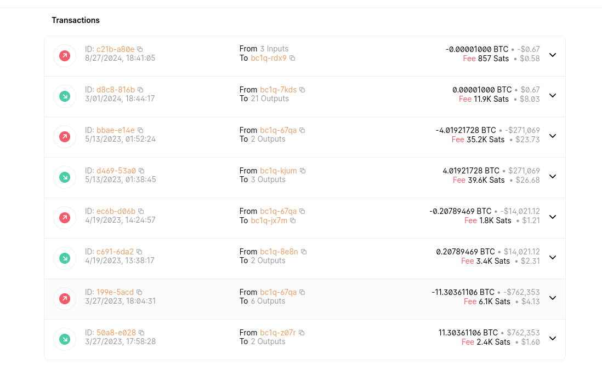
