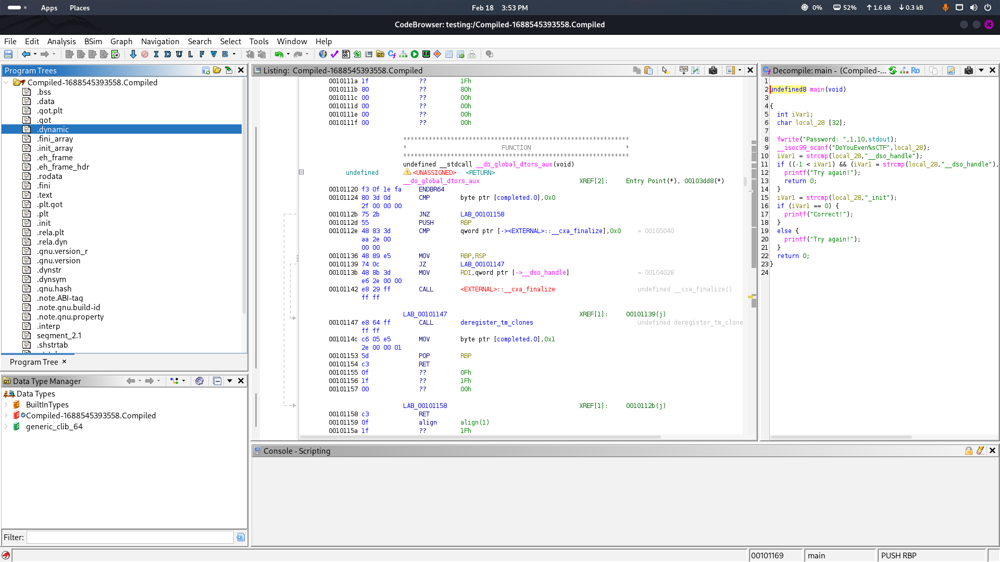
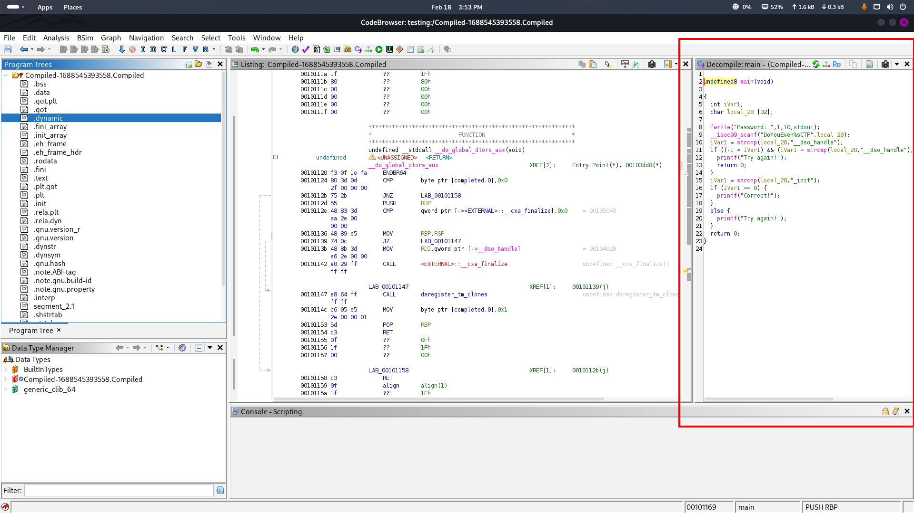
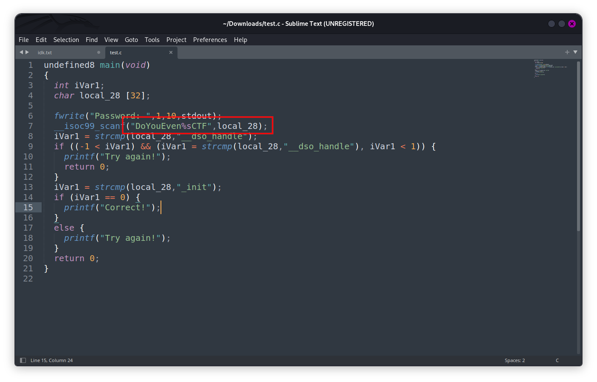
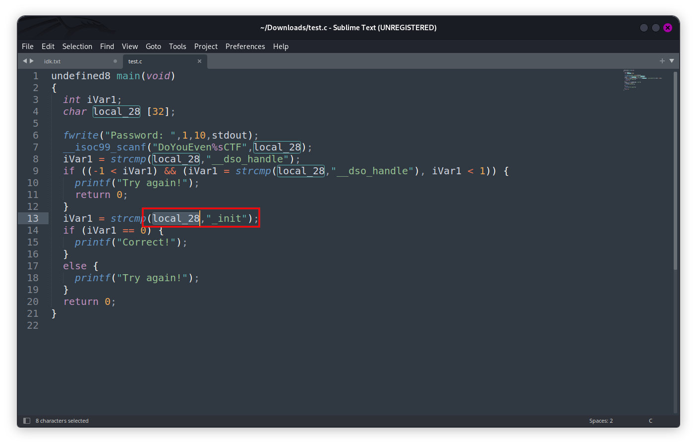

# Compiled

## Room Info

This room is a binary analysis challenge. You download the file and analyze it (even if it won’t run in the AttackBox) by following the program’s logic to uncover the answer.

## Writeup

There’s no machine here, so I downloaded the binary and inspected it directly. I used Ghidra for the analysis.

After importing the file, I got the standard Ghidra interface.  
Screenshot:  

The binary is ELF format. When I opened it, the main code appeared on the right side, so I focused there first.  
Screenshot:  

To make it easier to read, I copied the decompiled C code into a text editor. That made it simpler to trace the logic line-by-line.

In line 7, there’s a fixed part of the password: `DoYouEven`. The rest of the password comes from a variable called `local_28` and gets appended.  
Screenshot:  

Then in line 13, the code compares `local_28` to a specific string. If it matches, the password is accepted.  
Screenshot:  

So the final answer is just:
`DoYouEven` + the string compared against `local_28` (no spaces or `+`).
