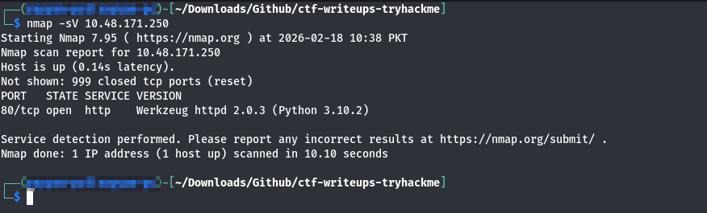
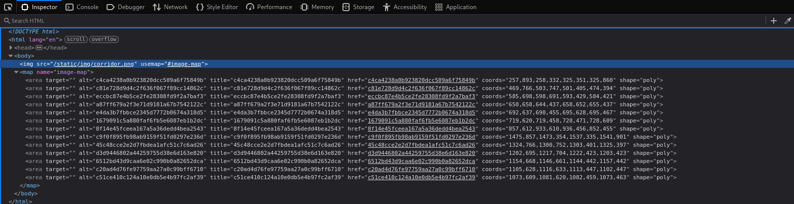
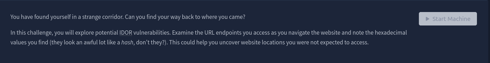
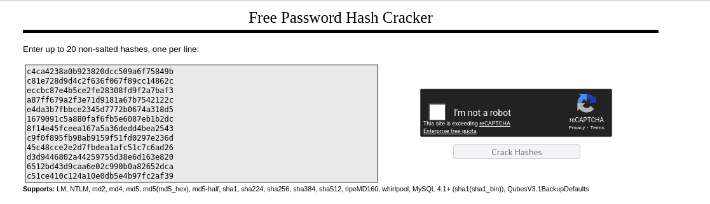
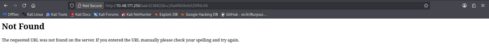

# Corridor

## Room Info

This room drops you into a weird hallway full of doors and nudges you to think about IDOR-style URL guessing. The idea is to pay attention to the URL patterns you discover, especially the hex-looking strings that feel like hashes, and use that to reach pages you weren’t supposed to.

## Writeup

I started the machine and waited about a minute so everything could fully boot. Since I use my own box, I connected to the TryHackMe VPN first (you can skip this if you’re using the AttackBox). Then I made sure I could reach the target with `ping MACHINE_IP`.

As always, I did a quick scan: `nmap -sV MACHINE_IP`.  
Screenshot:  

The scan showed HTTP was open, so I went straight to the web page in the browser: `http://10.48.171.250/`.  
Screenshot:  

The page showed a corridor full of doors. I inspected the page and noticed each door pointed to its own URL path.  
Screenshot:  

I clicked around manually out of curiosity and noticed the door URLs looked like hashes. The task hints at this too, which was a nice confirmation.  
Screenshot:  

I tried cracking a few of those values with CrackStation and got a simple sequence: numbers from 1 to 13.  
Screenshot:  

That got me thinking: if 1–13 are valid, what about the next number? I generated the hash for 14 using CyberChef and tried dropping it into the URL (classic IDOR-style guessing).  
Screenshot:  

No luck. So I went lower and tried hashing 0 and 0f. When I used the 0f hash in the URL, I finally hit the page with the flag.  
Screenshot: `{ss:flag}`
