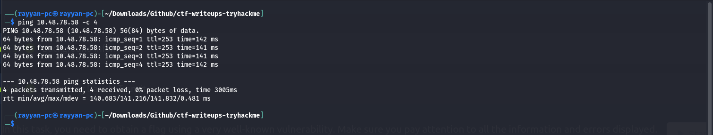
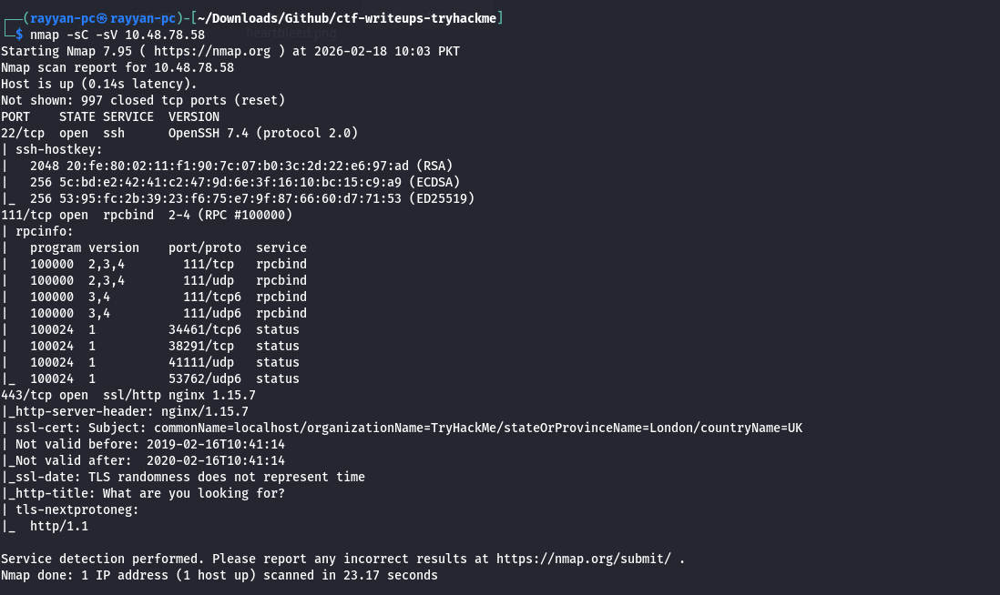
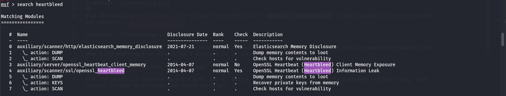
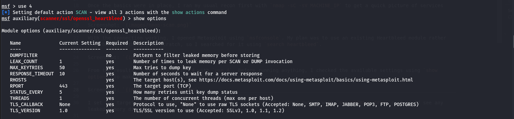
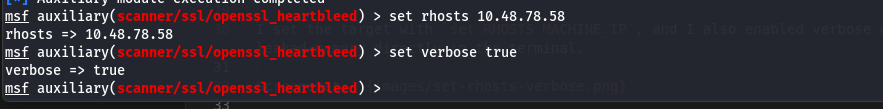
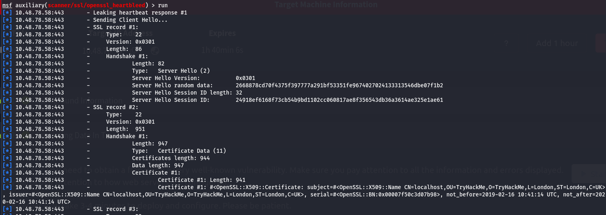

# HeartBleed

## Summary

Short explanation of Heartbleed (click to expand)

Heartbleed is a bug in OpenSSL’s heartbeat implementation that lets a client trick a server into returning more memory than it should. The client sends a heartbeat request that claims a payload length larger than what was actually sent, and the server replies with that extra memory. This can expose sensitive data that should never leave the server, such as private keys, usernames, passwords, and other confidential information.

This vulnerability only exists in specific OpenSSL versions — it affects OpenSSL 1.0.1 through 1.0.1f. Later versions fixed the issue by validating the heartbeat payload length before copying and replying.

## Writeup

I started by connecting to the TryHackMe VPN since I use my own machine as the attacker box. Right after that, I always verify connectivity to the target so I don’t waste time later. A quick `ping MACHINE_IP` confirmed the machine was up.

Screenshot:  

Once the basics were in place, I ran my usual recon first with `nmap -sC -sV MACHINE_IP` to get a quick picture of services and versions.

Screenshot:  

With the connection working, I opened Metasploit using `msfconsole`. My plan was to use an existing Heartbleed module rather than build anything from scratch, so I searched for it using `search heartbleed`.

Screenshot:  

From the results, I selected option 4 with `use 4`. Before running anything, I checked the available settings using `show options` to make sure I knew what needed to be set.

Screenshot:  

I set the target with `set RHOSTS MACHINE_IP`, and I also enabled verbose output with `set VERBOSE true` so I could see any leaked memory directly in the terminal.

Screenshot:  

Once everything looked right, I ran the module and watched the output. The leaked data appeared in the terminal, and that’s where the flag was hiding. I had to scan the output carefully, but it was there.

Screenshot:  

