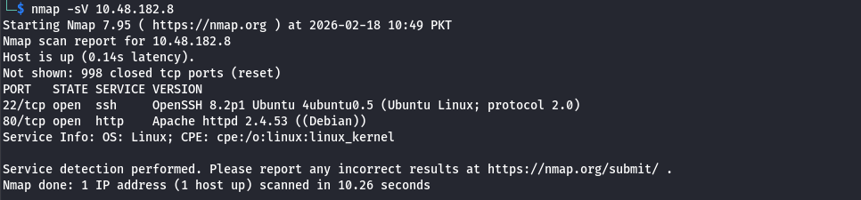
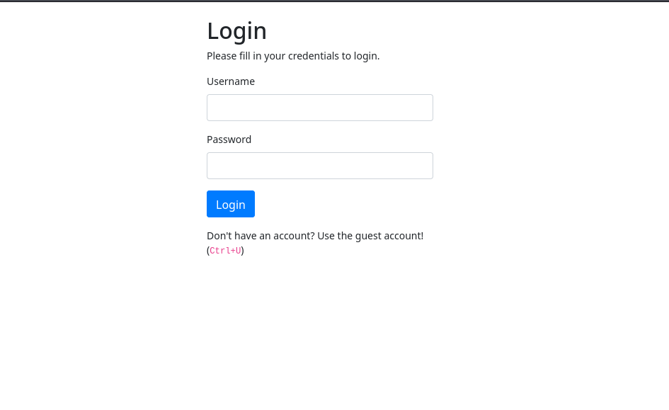
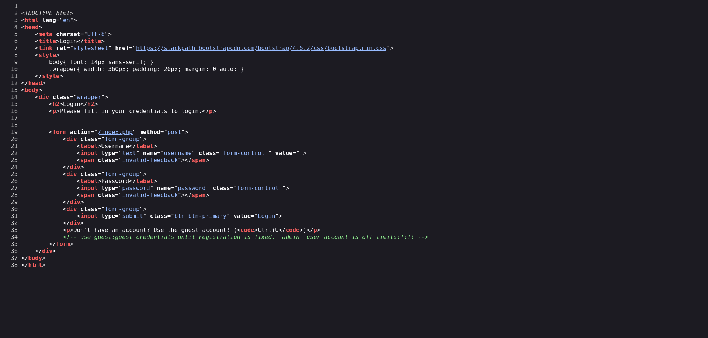
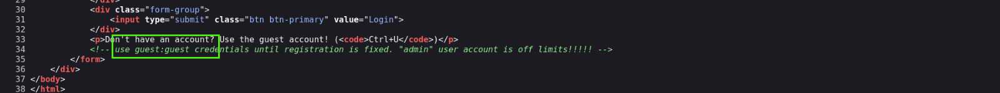
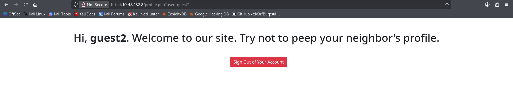
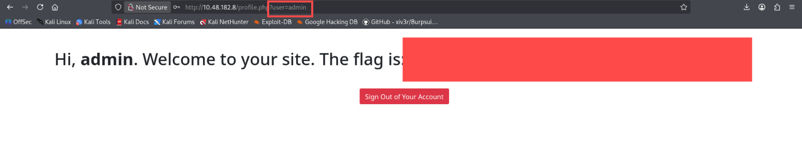

# Neighbour

## Room Info

This room is about a “login from anywhere” web app and hints that the real goal is to peek into someone else’s profile. It’s basically an IDOR-style exercise where you look at how user pages are accessed and then try to reach a page you shouldn’t.

## Writeup

I started the machine, waited about a minute for it to fully boot, and connected to the TryHackMe VPN (skip this if you’re using the AttackBox). I always confirm the target is reachable, so I ran `ping MACHINE_IP` first.

Next, I did a quick scan with `nmap -sV MACHINE_IP` to see what was open.  
Screenshot:  

HTTP was open, so I visited `http://MACHINE_IP` in the browser.  
Screenshot:  

There’s a login form on the page. I also noticed a hint that says: “Don’t have an account? Use the guest account! (Ctrl+U)”. That basically screams “check the page source.”

I opened the page source (Ctrl+U / right-click > view page source).  
Screenshot:  

Inside the source, the guest credentials were sitting there in green text.  
Screenshot:  

I used those credentials to log in and landed on a user page. From here, the most obvious next move is to test for IDOR by manipulating the `user` parameter in the URL. If you want a quick refresher on IDOR, the TryHackMe room is `https://tryhackme.com/room/idor`.

I changed `user=guest` to `user=guest1` and `user=guest2`. Both worked, which confirmed the weakness.  
Screenshot:  

I tried a few other guesses like `user=neigbour` but got nothing useful. When I set `user=admin`, the flag showed up. Find it on your own.  
Screenshot:  

