# Pickle-Rick

## Room Info

This room is a Rick and Morty themed challenge where the goal is to find three secret ingredients hidden across the system. It covers basic web enumeration, directory fuzzing, a command injection panel, and some simple privilege escalation to read files owned by root. Good entry-level room for getting comfortable with the recon-to-foothold-to-escalation flow.

## Writeup

I connected to the TryHackMe VPN and confirmed the machine was reachable with a quick ping.

`ping 10.49.175.108`

Screenshot:
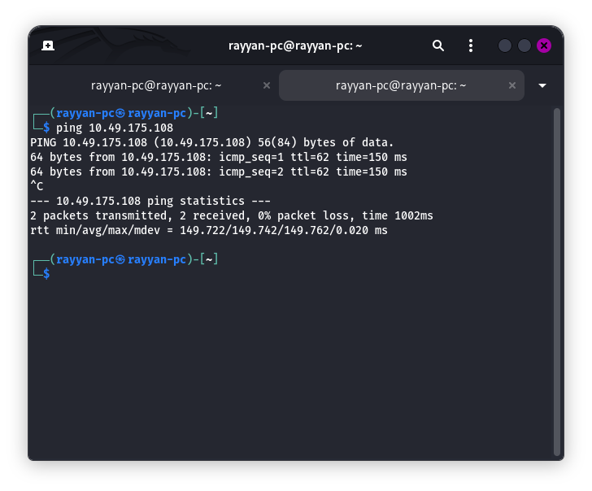

Then I ran an nmap scan to see what was open.

`nmap -sV 10.49.175.108`

Screenshot:
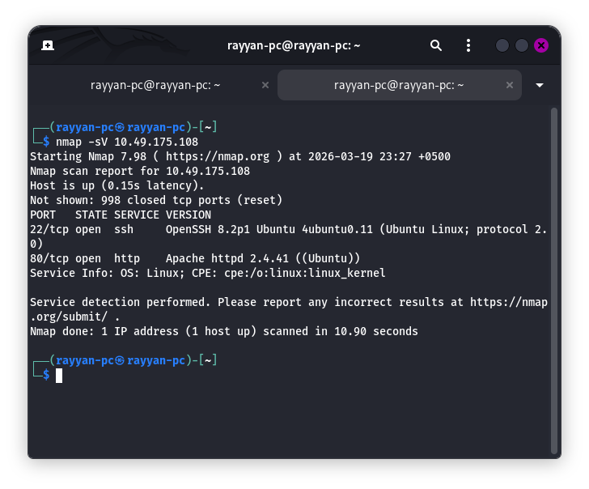

SSH and HTTP were both open. Since the room description pointed at the web app, I headed straight to the browser.

`http://10.49.175.108/`

Screenshot:
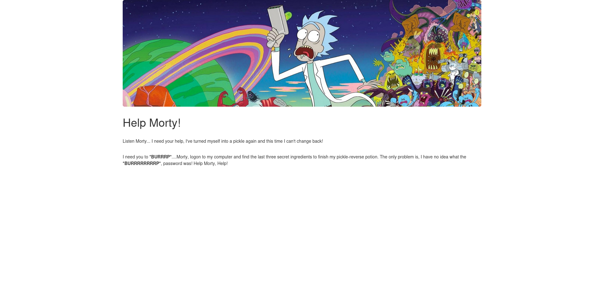

The homepage looked pretty bare. Before poking at anything else I checked the page source — this is almost always worth doing early on.

Screenshot:
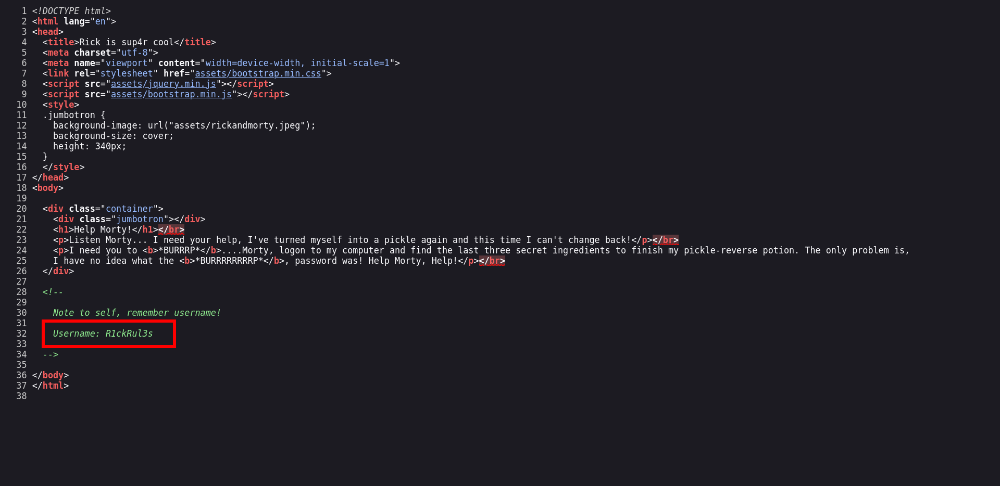

There it was — a username sitting in a comment: `R1ckRul3s`. That's a solid lead. Rather than guess where to use it, I ran gobuster to map out the site first.

`gobuster dir -u http://10.49.175.108/ -w /usr/share/wordlists/dirbuster/directory-list-2.3-medium.txt -x php,txt,html`

Screenshot:
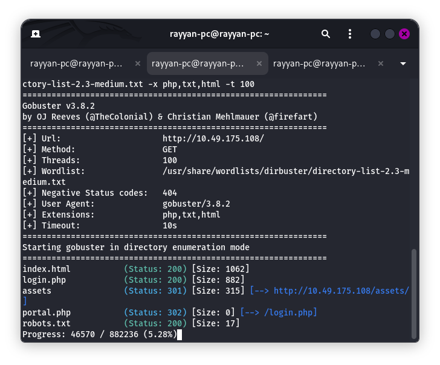

It came back with a few interesting paths: `index.html`, `login.php`, `assets/`, `portal.php`, and `robots.txt`. I checked `robots.txt` first since those sometimes hide useful paths or hints.

Screenshot:
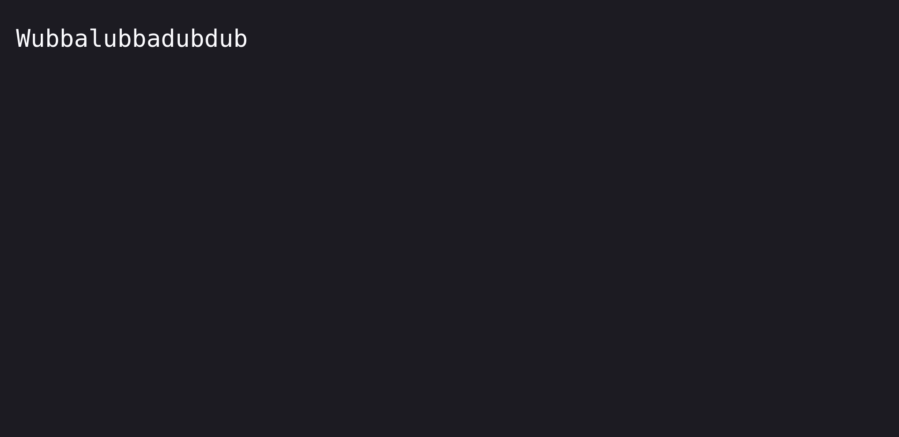

There was a weird phrase in there instead of any actual paths. It stood out immediately as something to hold onto — looked like it could be a password. I tried it on `login.php` (which redirected to the same place as `portal.php`) with the username I'd already found. It worked.

Screenshot:
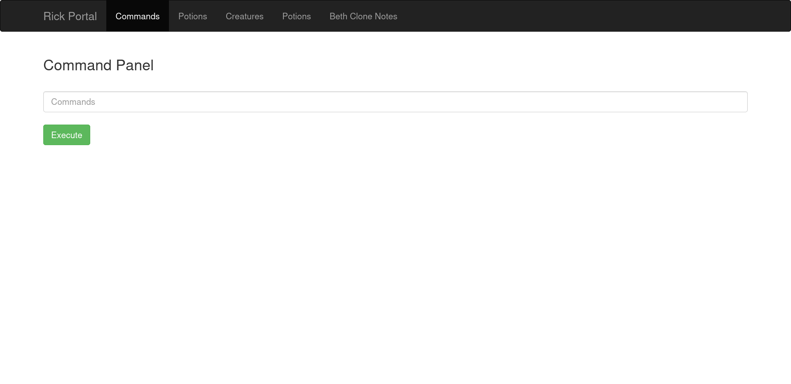

The portal had a command execution panel. Every page other than "Commands" threw a "only real rick can view this page" error, so I focused there. I ran `ls` to see what was in the current directory.

Screenshot:
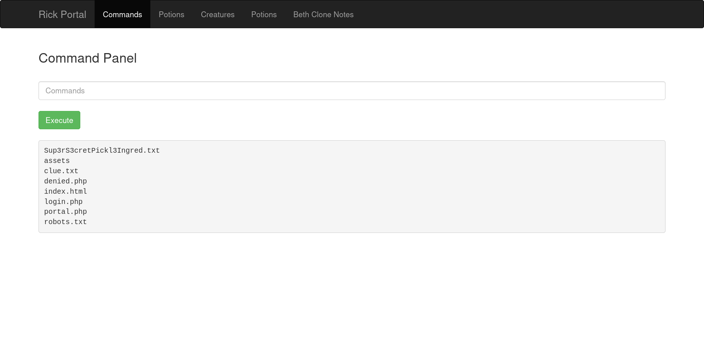

I could see `Sup3rS3cretPickl3Ingred.txt` and `clue.txt` right away. I tried `cat` on both files but the app blocked it with a message saying the command was disabled. I switched to `less` instead, which wasn't blocked.

`less Sup3rS3cretPickl3Ingred.txt`

Screenshot:
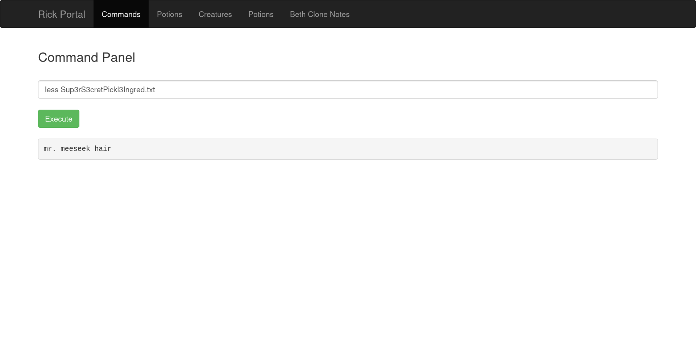

First ingredient, done. I did the same for `clue.txt`, which told me to look around the filesystem for the next one. While I was poking around I also checked the page source of the commands page out of habit and spotted something suspicious.

Screenshot:
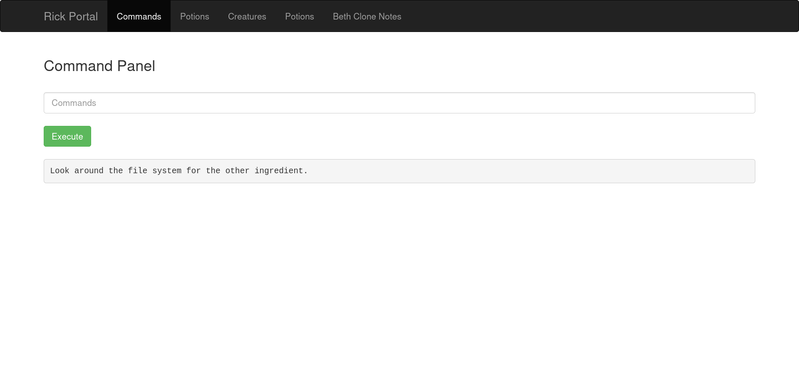

It looked encoded, so I threw it into CyberChef and stacked a few From Base64 operations until something readable came out.

Screenshot:
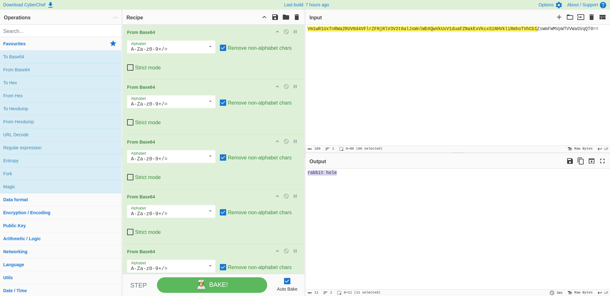

It decoded to something, but after sitting with it for a bit I couldn't find anywhere useful to apply it. Felt like a rabbit hole, so I moved on and followed the clue instead.

I started browsing the filesystem through the command panel. I checked `/home/rick` and found something there.

Screenshot:
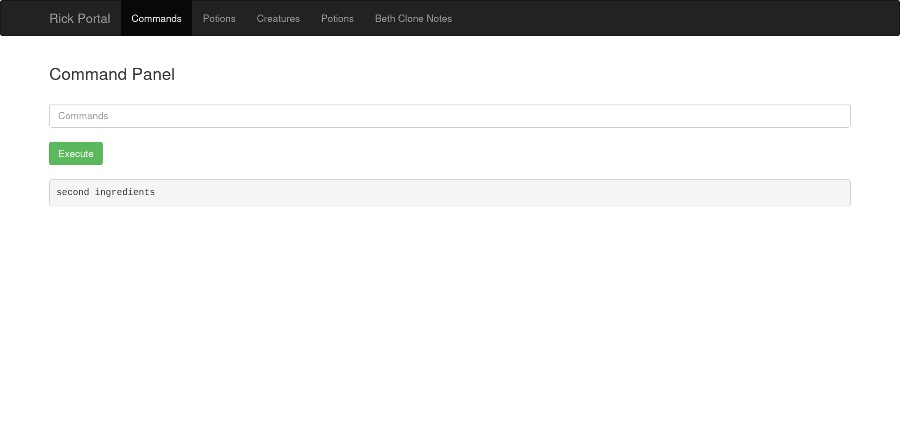

There was a file called `second ingredients` — the space in the name meant I had to quote it. Since the panel let me chain commands with `&&`, I used `less` again.

`less /home/rick/"second ingredients"`

Screenshot:
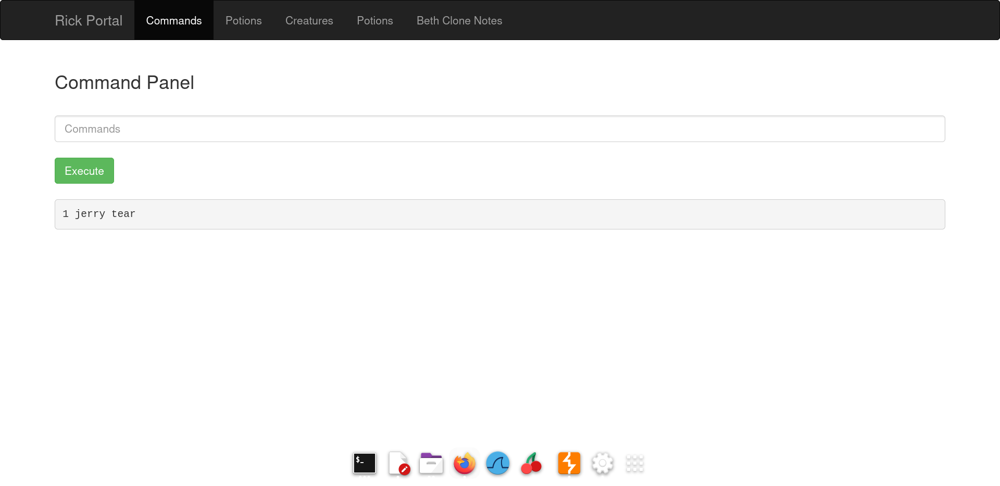

Second ingredient down. For the third I tried `/root` directly but got a permission denied. I ran `sudo -l` to check what I could run with elevated privileges.

Screenshot:
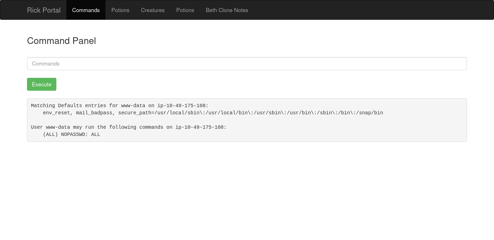

The output showed `(ALL) NOPASSWD: ALL` — I could run everything as root without a password. I used that to list `/root` and then read the file.

`sudo ls /root`
`sudo less /root/3rd.txt`

Screenshot:
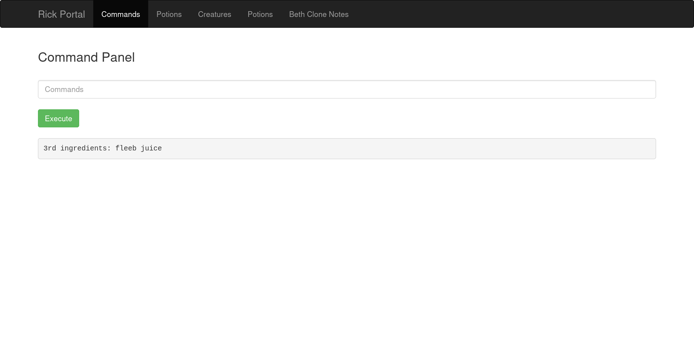

All three ingredients found. The flag was there.
