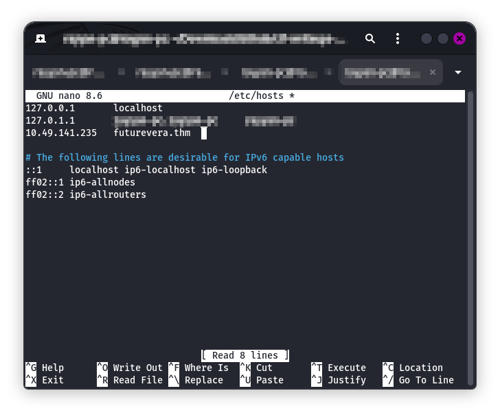
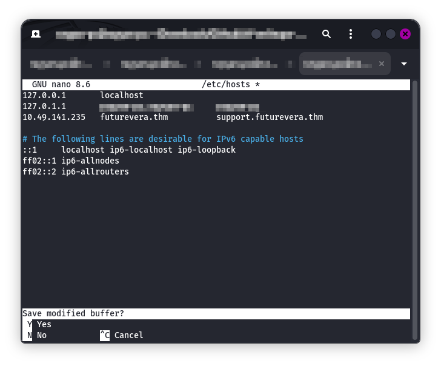
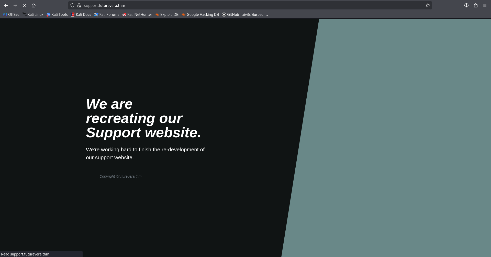
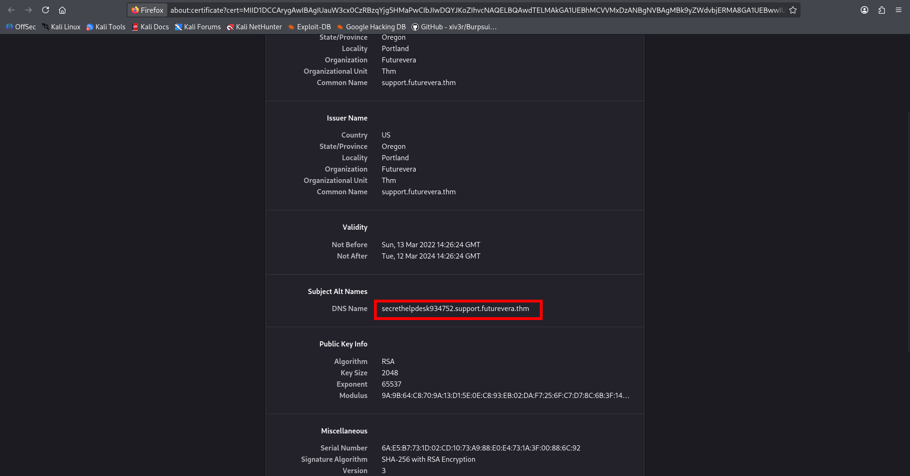
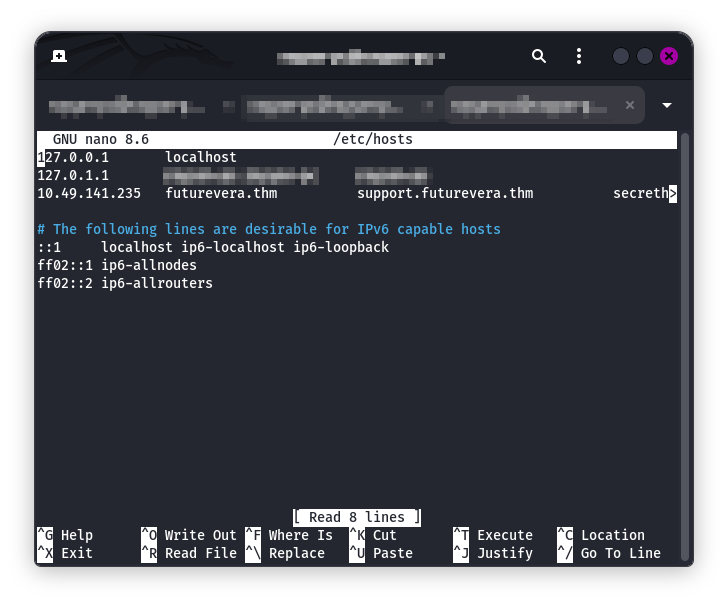
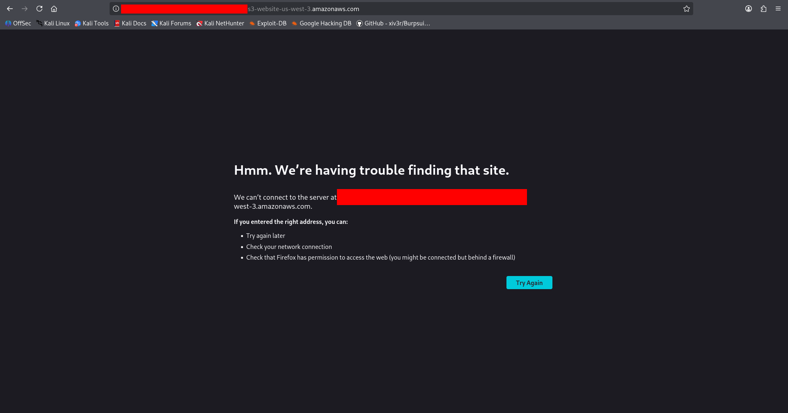

# TakeOver

## Room Info

This room is about a company site (`futurevera.thm`) that believes attackers might be able to take something over. The goal is to explore the site and related subdomains to identify what can be hijacked and grab the flag.

## Writeup

I started the machine and waited about a minute for it to fully boot. Since I use my own box, I connected to the TryHackMe VPN (skip this if you’re using the AttackBox). Then I confirmed the target was reachable with `ping MACHINE_IP`.

We’re told to use the `futurevera.thm` domain, so I added it to `/etc/hosts` using `sudo nano /etc/hosts`. I wrote it like this (use your target IP, not the one in the screenshot):  
Screenshot:  

After saving, I visited `https://futurevera.thm/`. The page was super simple: mostly static content and a button that just scrolls the page. I checked page source and inspected the elements, but there was nothing obvious to use.  
Screenshot:  

Since the prompt mentions their support page is being rebuilt, I tried to find it. First I checked `https://futurevera.thm/support`, but nothing useful showed up.

Next, I guessed it might be on a separate subdomain and tried `https://suppor.futurevera.thm/` (typo intentional because that’s what I tested). To load it, I had to add another entry to `/etc/hosts`.  
Screenshot:  

That actually loaded something.  
Screenshot:  

Even though it was HTTPS, the browser complained about the certificate. I inspected the certificate details and found a URL in there.  
Screenshot:  

I added that URL to `/etc/hosts` as well.  
Screenshot:  

When I visited the new URL, the flag appeared.  
Screenshot:  

