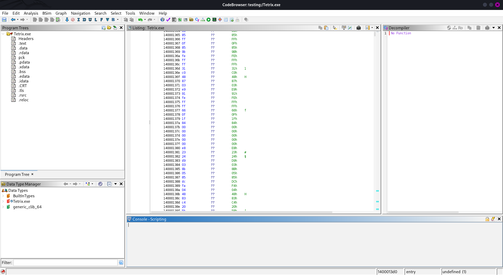
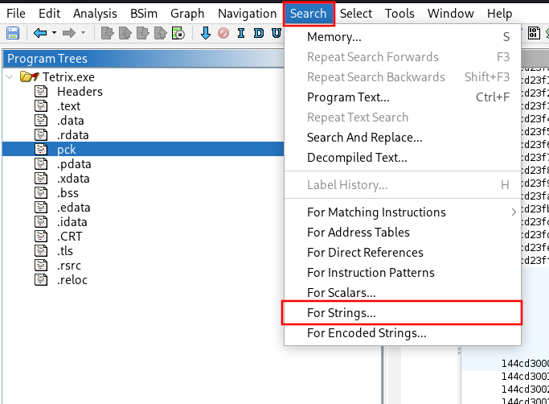
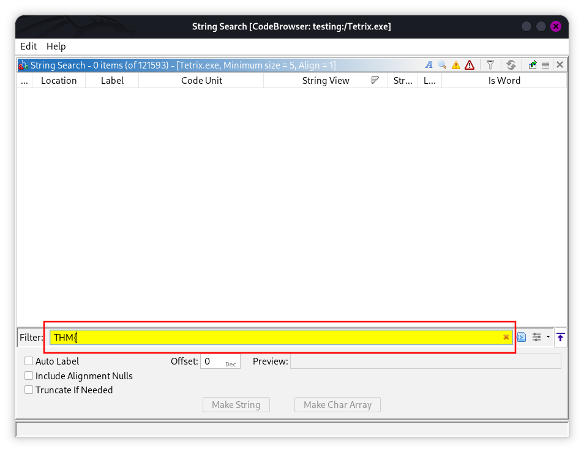
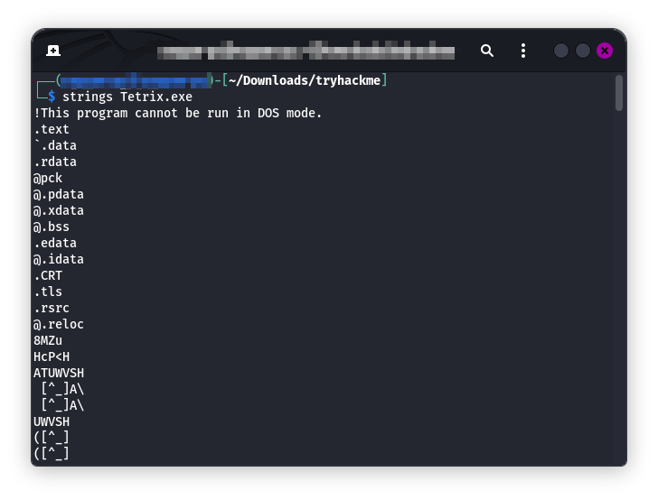
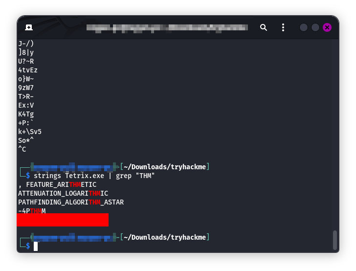

# The-Game

## Room Info

This room is about an EXE file tied to a Tetris-themed challenge where hidden data is embedded in the game. The goal is to reverse or inspect the binary to uncover the flag.

## Writeup

I went in expecting a machine, but there isn’t one here — just a downloadable `.exe`. So instead of starting a box, I downloaded the file and focused on static analysis.

For inspection, I used Ghidra (you can also use PeStudio). After importing the EXE, I got the usual Ghidra project interface.  
Screenshot:  

Manually digging through everything felt like a waste of time, so I switched to string hunting. In Ghidra I went to `Search > For Strings` and hit the search button.  
Screenshot:  

Since most TryHackMe flags look like `THM{...}`, I searched for `THM`.  
Screenshot:  

No luck there, which was a bit disappointing. So I quickly looked up how people usually pull strings from EXE files and found the `strings` utility.

I ran:
`strings Tetrix.exe`  
Screenshot:  

That output was huge, so I used `grep` to filter it:
`strings Tetrix.exe | grep "THM"`  
Screenshot:  

